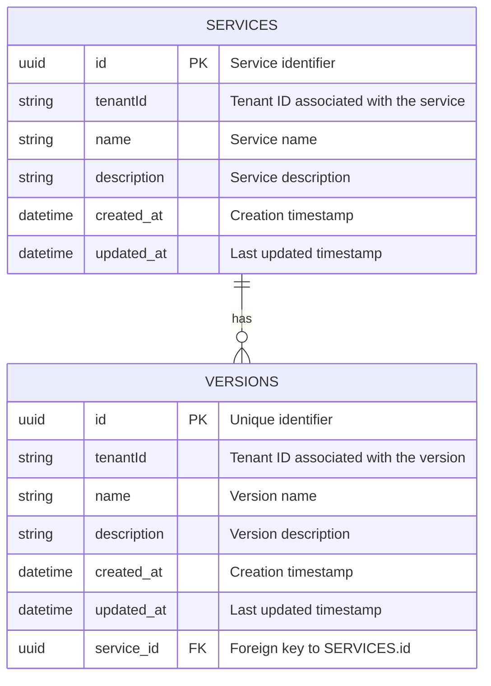
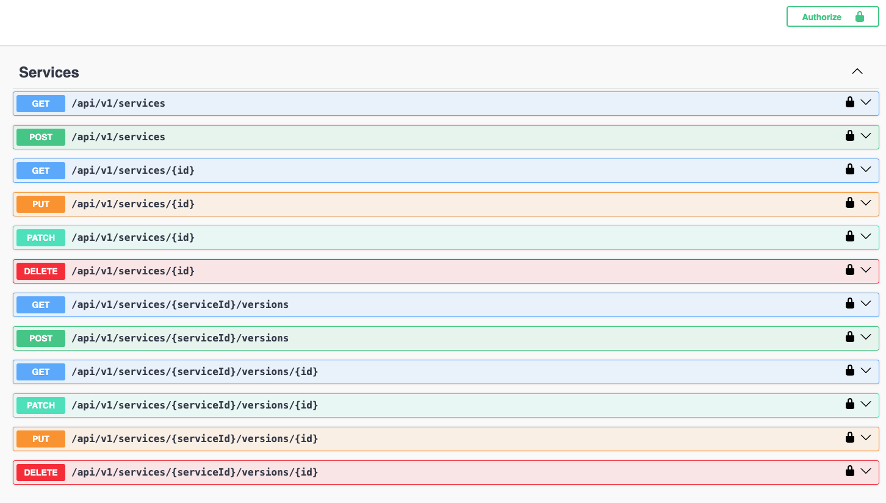

# Description

This is a services API that allows users to manage services and their versions. The API is built using NestJS and provides a RESTful interface for CRUD operations on services and versions.

## Table of Contents

- [Tech stack](#tech-stack)
- [Installation](#installation)
- [Running the app](#running-the-app)
- [Sorting](#sorting)
- [CRUD](#crud)
- [Auth](#auth)
- [Multi-Tenancy](#multi-tenancy)
- [Testing](#testing)
- [Configuration](#configuration)
- [SRE Considerations](#sre-considerations)

## Tech stack

- Node.js (v22)
- Typescript
- Postgres
- TypeORM
- Nest.js

## Installation

```bash
$ npm install
```

## Running the app

Setup [.env](./.env.example) file:

```
cp .env.example .env
```

Ensure that postgres is running (using `docker-compose`):

```
npm run infra
```

To seed demo data:

```
npm run seed
```

```bash
# development
$ npm run start

# watch mode
$ npm run start:dev

# production mode
$ npm run start:prod
```

Swagger UI should be available at http://localhost:3000/api

## Database

Ensure that postgres is running (using `docker-compose`):

```
npm run infra
```

Create a manual migration:

```
npm run typeorm migration:create -n ./src/migrations/NewMigration
```

Generate from entities:

```
npm run typeorm migration:generate -n ./src/migrations/NewMigration
```

To shutdown the postgres:

```
npm run infra:down
```

## Test

```bash
# unit tests
$ npm run test

# e2e tests
$ npm run test:e2e
```

# Design

Here is a brief description of the design decision behind the application. There are many ways to solve the same problem, and I believe that design decisions in an industrial setting should follow the organization's conventions because consistency is crucial for engineering productivity. Here is one approach to designing the required service.

## Data Model



Typeorm is used to work with the database. It uses migrations instead of sync to prevent data loss in production and ensure consistency between production and dev env.

The typeorm cli with config setup is avaialble via `npm run typeorm`. E.g.:

```
npm run typeorm migration:generate -n ./src/migrations/BaseMigration
```

## API Versioning

The API is exposed at `/api/v1`, so versioning is built into the route. The Swagger UI is fully functional and available at `GET /api` in non-production environments (i.e., when `NODE_ENV !== production`).

## Code structure

The application follows a `controller-service-repository` pattern that is similar to the Clean Architecture approach. Currently, there is a single NestJS `services` module, and versioning is incorporated within that module because versions are only meaningful in the context of a service - they serve as a sub-resource of the service.

## Searching

I was unsure whether to implement filtering or searching. We discussed in Panel 1 that it should be searching. I decided to implement a simple `contains` search on both the name and description fields, as I believe it sufficiently supports the search text box user story. This is implemented using a `search` query parameter that leverages the SQL `ILIKE` operator with `%search%` syntax.

### Why ILIKE?

While `ILIKE` can be slow — especially with the `%search%` pattern since `B-Tree` indexes cannot be utilized to narrow the search space — I think it's sufficient for now. Given that we're only querying services for a specified tenant, the performance impact should be minimal.

However, I recommend closely monitoring the query performance and considering the use of a `trigram-based GIN` index to alleviate potential issues while we transition the search functionality to a more suitable platform (e.g. `OpenSearch`).

### Why not full-text search?

Postgres offers robust full-text search capabilities using `tsvector`, and it performs efficiently when handling smaller datasets or when paired with a good partitioning scheme. However, there are some challenges:

- Implementing multi-language support can be difficult (and service descriptions might be multilingual I believe).
- Substring matching (similar to the `ILIKE %search%` behavior) is hard to achieve, as full-text search is designed primarily for matching whole words.

## Pagination

The API implements offset-based pagination as discussed during Panel 1. Clients can control pagination using two query parameters: an `offset` to skip a specified number of records and a `limit` to restrict the number of records returned per request.

API responses include metadata about the total number of records available in a `meta` property. This allows clients to calculate the total number of pages and implement pagination controls. For example:

```

curl -X 'GET' \
 'http://localhost:3000/api/v1/services?offset=3&limit=5' \
 ...

```

Returns

```
{
"meta": {
"total": 10
},
"data": [
  {
    "id": "e0763530-5bb3-4f26-a959-3925ef4c1443",
    "name": "Service 4",
    "description": "Description for Service 4",
    "updatedAt": "2025-02-19T19:10:27.869Z",
    "createdAt": "2025-02-19T19:10:27.869Z",
    "versionsCount": 10
  },
  //... other 4 services
  ]
}

```

### Implementation

The API reuses the same DTO for both responses and requests for the `services` and `versions` resources to maintain a consistent contract. The `limit` and `offset` parameters are passed down to the repositories and the database, ensuring that DB indexes are leveraged for better performance.

### Why Offset-Based Pagination?

We talked about that during Panel 1 and offset-based pagination was chosen primarily for its simplicity and its seamless integration with sorting and searching. While cursor-based pagination avoids some downsides of offset-based pagination, it is more complex to implement.

## Sorting

The sorting approach allows API clients to specify how the result set should be ordered. The implementation leverages NestJS decorators along with class-transformer and class-validator to process and validate the incoming sorting parameters.

For example:

```

curl -X 'GET' \
 'http://localhost:3000/api/v1/services?offset=0&limit=10&sort=name%20asc&sort=updatedAt&'

```

The API will sort the response first by `name` in ascending order and then by `updatedAt` in ascending order (the default). Sorting parameters are passed down to the repository, and the entity specifies which properties can be sorted—along with indexes on those properties—to ensure efficient querying.

## CRUD



The API supports basic CRUD operations for both the versions and services resources.

## Auth

Authentication is implemented using JWT tokens, which must be provided in the `Authorization` header. Both the `version` and `services` resources require authorization, and the authentication schema is detailed in the OpenAPI specification.

Additionally, Swagger UI comes with a pre-signed token for immediate testing, though you can also provide your own token if needed.

## Multi-Tenancy

I believe it makes sense to support multi-tenancy since the services are usually associated with an organization. The `tenantId` is provided in the JWT and is simply passed down to the repository, where it's included in each query. Both the `services` and `versions` resources have indexes or composite indexes that include the `tenant_id` column.

An alternative approach for ensuring multi-tenancy in the database would be to use Row-Level Security in PostgreSQL. This method is more robust but would require additional boilerplate code to integrate with TypeORM.

## Testing

I have added end-to-end tests for both the `versions` and `services` resources. Additionally, unit tests have been implemented for some shared utilities used across both modules.

Moving forward, I would improve the testing strategy by adding:

- More e2e testcases (e.g. search is not covered right now)
- **Unit tests** for the services (though a lot of the logic is covered by e2e right now as it's a basic CRUD sicne we don't have many domain rules).
- **Integration tests** for the repositories.

Furthermore, I would isolate the testing database -- e.g. by using `testcontainers`. Currently, the tests run against a shared database, using a separate `tenant_id` for each e2e test, which isn’t ideal, especially for integration tests.

## Configuration

Local configuration is managed via `.env` file. The configuration is integrated into the application using the standard `@nestjs/config` package.

Currently, the app runs locally while the database is running in a container. We can add a Dockerfile and run the app in a container as well to ensure consistency with the production environment. However, during the initial development phase, it might be wise to develop locally to maintain optimal development velocity.

## SRE Considerations

- **Logging/Observability:**  
  Currently, no advanced logging or observability solution is configured. While NestJS's basic logging is available, it does not output in JSON format. I recommend using `pino-logger` for structured logging, which integrates well with NestJS.

- **Environment Variables:**  
  In a production environment, need to ensure that all necessary environment variables are properly provided to the application.

- **Readiness and Liveness Probes:**  
  Before going to production, implement readiness and liveness probes:

  - **Readiness Probe:**  
    Validate the application's configuration (which can be easily done using the `@nestjs/config` module) and check access to the database (and any other dependencies that may be added in the future).
  - **Liveness Probe:**  
    The liveness probe can be very simple, just returning a 200 status code. It's best not to validate external dependencies in the liveness probe. If the application maintains a complex state, the liveness check should ensure that this state is recoverable.
